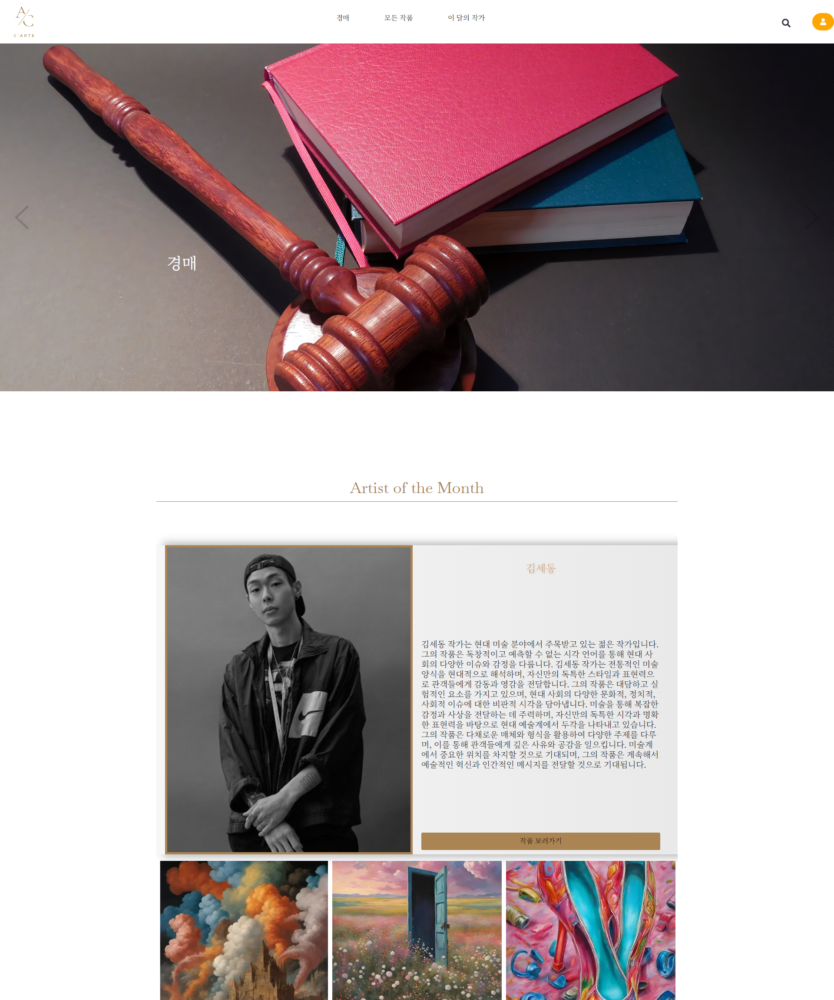
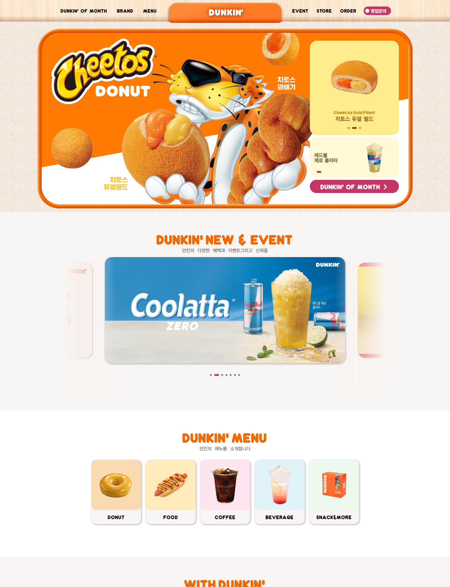

  <h1>STACKS</h1>
  

    
    
    
    
    
    
    
  

  <h1 align="center">PROJECT</h1>

| [C'Arte](https://github.com/bug0630/C-Arte) | [Dunkin](https://github.com/bug0630/Dunkin_renewal) | [Freshway](https://github.com/bug0630/Freshway) | [Dapara](https://github.com/bug0630/Dapara) |
|---|---|---|---|
|  |  |  |    |

##

<!-- . -->

<!---->
